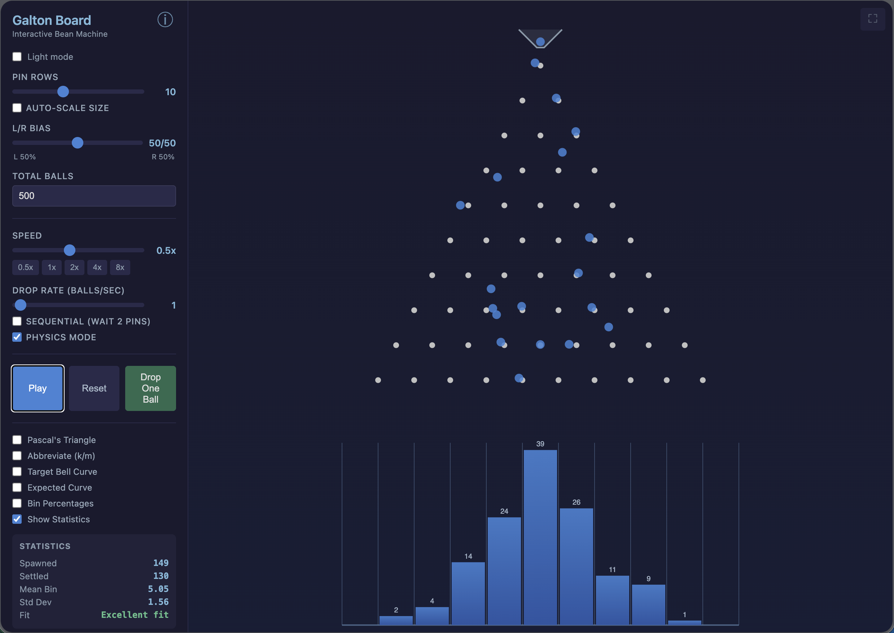

# Galton Board — Interactive Probability Simulator

An interactive web-based [Galton Board](https://en.wikipedia.org/wiki/Galton_board) (bean machine) simulator for teaching probability and the Central Limit Theorem.

**Live demo: [galton.markheckmann.de](https://galton.markheckmann.de)**



## What is a Galton Board?

A Galton Board drops balls through a triangular grid of pins. At each pin, a ball bounces either left or right with equal probability. After passing through all rows, balls collect in bins at the bottom, forming a distribution that approximates the **bell curve** (normal distribution).

This happens because each ball's final position is the sum of many independent random events — a physical demonstration of the **Central Limit Theorem**.

## Features

### Simulation Controls
- **Pin rows** (1–25) — adjust the number of decision points
- **L/R bias** — skew the left/right probability away from 50/50 to explore biased distributions
- **Speed** (0.05x–10x) — slow down to watch individual bounces or speed up to see the distribution emerge
- **Drop rate** (0–10,000 balls/sec) — fine-grained steps (0.25 increments up to 2, then integers, then exponential). Set to 0 to pause spawning while the simulation continues
- **Sequential mode** — drops balls one at a time, waiting for each to pass 2 pins
- **Drop One Ball** — drop a single highlighted ball, even while paused
- **+/− buttons** on all sliders for precise single-step adjustments

### Physics Mode
Toggle between two animation styles:
- **Path mode** — smooth easing between pins with subtle wobble at each decision point
- **Physics mode** (default) — ballistic arcs with gravity, where balls launch from each pin and curve down to the next

### Ball Tracking
- Click any ball to **highlight and track** it (up to 5 simultaneously)
- Highlighted balls show a **color trail**, **predicted path**, and **target bin**
- Info display shows the ball's row, path decisions (L/R), and destination
- Highlights auto-expire 5 seconds after the ball settles

### Educational Overlays
- **Pascal's Triangle** — shows path counts at each pin (with abbreviation option for large numbers: k/m), adjustable font size
- **Target Bell Curve** — faint filled curve showing the theoretical distribution the histogram will converge toward
- **Expected Curve** — dashed line overlay scaling with settled balls for comparison
- **Mean / Std Dev Lines** — vertical μ line and ±1σ brackets drawn directly on the histogram
- **Bin Percentages** — toggle between counts and percentages above bins
- **Live Statistics** — spawned/settled counts, mean, standard deviation, and goodness-of-fit (shown as canvas overlay)

### Visual Effects
- **Pin flash** — pins glow when balls bounce off them, creating a visible cascade
- **Bin splash** — expanding ring pulse when balls land in bins
- **Trails** — configurable duration, width, and opacity. Trails stay at full opacity while the ball falls, then fade uniformly after settling
- **Funnel animation** — balls visibly queue inside the funnel with remaining count displayed
- **Auto-scale sizing** — optional scaling so the board fills the canvas (ideal for high row counts)
- **Adjustable label sizes** — separate font size controls for bin counts and Pascal numbers

### Other
- **Dark/Light mode** — toggle button on the canvas
- **Fullscreen mode** — hide sidebar, expand canvas (button or F key)
- **Info overlay** — explains the Galton Board, Central Limit Theorem, and the underlying math
- **Shareable URLs** — all settings encoded in the URL hash for sharing configurations
- **Progress bar** — thin bar at the top showing how many balls have been dropped
- **Reset Settings** — button to restore all controls to defaults
- **Keyboard shortcuts**:
  - `Space` — play/pause
  - `R` — reset simulation
  - `D` — drop one highlighted ball
  - `F` — fullscreen
  - `←/→` — adjust speed
  - `↑/↓` — adjust drop rate
  - `Esc` — close overlay
- **Tooltips** — hover over any control for an explanation
- **Responsive layout** — two-column controls on narrow screens
- **HiDPI support** — crisp rendering on Retina displays

## Getting Started

No build step or dependencies required — just serve the files with any HTTP server:

```bash
# Using Python
python3 -m http.server 8000

# Using Node
npx serve .
```

Then open `http://localhost:8000` in your browser.

## Technology

Built with vanilla JavaScript and HTML5 Canvas. No frameworks or dependencies.

- `index.html` — entry point with sidebar controls and canvas
- `style.css` — theming with CSS variables (dark/light)
- `js/app.js` — UI wiring and animation loop
- `js/ball.js` — path-based ball with easing interpolation
- `js/physics-ball.js` — physics ball with ballistic arcs
- `js/board.js` — pin grid and bin geometry
- `js/simulation.js` — spawning, stepping, settling, effects
- `js/renderer.js` — all canvas drawing with theme support
- `js/stats.js` — binomial distribution, Pascal's triangle, chi-squared

## License

MIT
